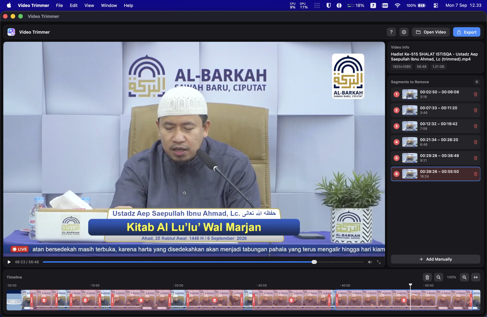
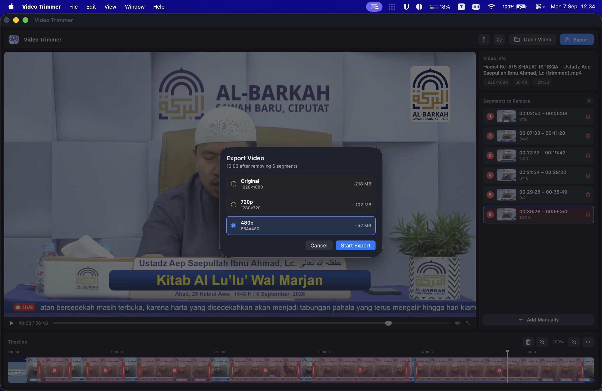
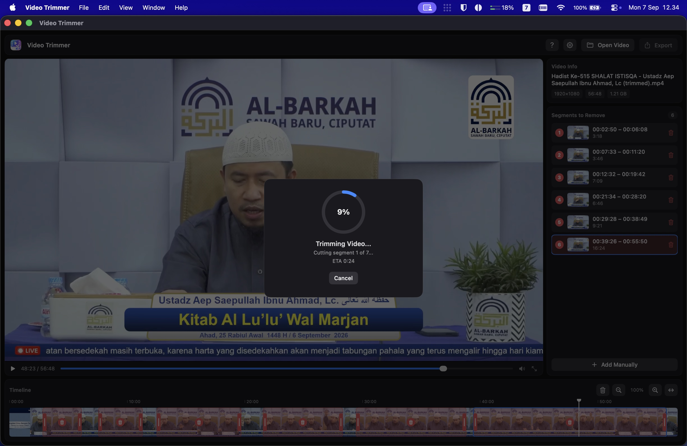
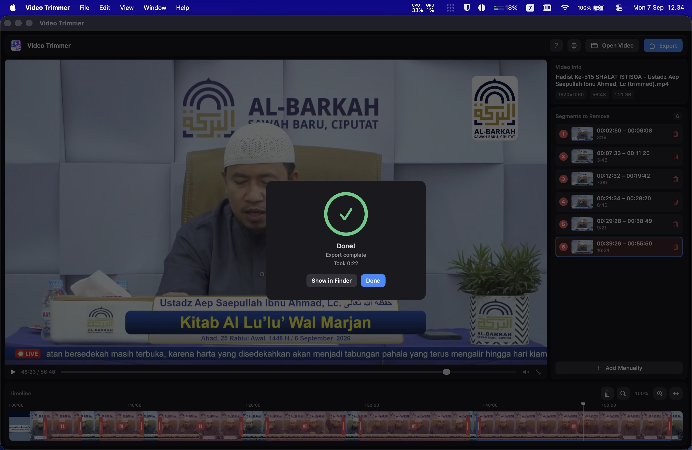

<p align="center">
  
</p>

<h1 align="center">Video Trimmer</h1>

<p align="center">
  Cut unwanted stretches out of a video — ad breaks, dead air, pauses in a recorded lecture —
  and export what's left as a single file.<br>
  Native macOS, built with SwiftUI and powered by <code>ffmpeg</code>. Apple Silicon only.
</p>

<p align="center">
  <a href="https://github.com/ahmadarif-lab/video-trimmer/releases/latest">
    
  </a>
</p>

## Screenshots

<p align="center">
  
  
</p>
<p align="center">
  
  
</p>

## Features

- Drag across the filmstrip timeline to mark a stretch for removal; drag the handles to fine-tune.
  Segments clamp against their neighbours, so they never overlap.
- Timeline built from real thumbnails, with a ruler, playhead, and zoom.
- Export at the original resolution or downscale to 1080p / 720p / 480p, each showing an estimated
  output size.
- Live progress with stage, ETA, and cancel.
- Hardware encoding through VideoToolbox — typically around 7× realtime on Apple Silicon.
- Manages its own `ffmpeg` dependency: check the version, install it, or update it from the
  settings panel.
- Drop a video from Finder anywhere on the window to open it.

## Shortcuts

| Key | Action |
| --- | --- |
| `Space` | Play / pause |
| `←` / `→` | Seek 10 seconds back / forward |
| Pinch or `⌘`-scroll | Zoom the timeline |

## Install

```sh
brew tap ahmadarif-lab/tap
brew install --cask video-trimmer
```

This pulls `ffmpeg` in as a dependency and clears the quarantine flag, so the app opens without any
Gatekeeper detour. Otherwise, grab the DMG from
[Releases](https://github.com/ahmadarif-lab/video-trimmer/releases/latest) and see the note under
[Package a DMG](#package-a-dmg) about clearing quarantine by hand.

## Requirements

- macOS on Apple Silicon
- `ffmpeg` and `ffprobe` in `/opt/homebrew/bin` — installed for you by the cask, or
  `brew install ffmpeg`, or from the app's settings panel
- Xcode command line tools, only if you build from source

## Build and run

```sh
./build.sh
open ~/Applications/"Video Trimmer.app"
```

`build.sh` compiles the sources, assembles the `.app` bundle, and ad-hoc signs it — no Xcode project
or developer certificate involved. Pass a path to install elsewhere:

```sh
./build.sh /Applications/"Video Trimmer.app"
```

## Package a DMG

```sh
./package-dmg.sh
```

Builds a fresh copy into `dist/` and writes `dist/VideoTrimmer.dmg`, containing the app beside an
`/Applications` shortcut to drag it onto.

The app is ad-hoc signed rather than signed with a Developer ID and notarized. Copied across
directly that is fine, but macOS quarantines anything downloaded through a browser, and Gatekeeper
then refuses to open it — *"Apple could not verify Video Trimmer is free of malware"*.

Clear the flag on the receiving Mac:

```sh
xattr -dr com.apple.quarantine /Applications/"Video Trimmer.app"
```

Or open it once through **System Settings → Privacy & Security**, where an **Open Anyway** button
appears after a blocked launch. Note that right-clicking the app and choosing **Open** no longer
works: macOS 15 removed that bypass for apps without a Developer ID signature.

## Support

This app is free, and there is no donation link. If it saved you some time, please pray that Allah
grants me and my family Paradise. That is all I ask for it.

## License

MIT — see [LICENSE](LICENSE).
