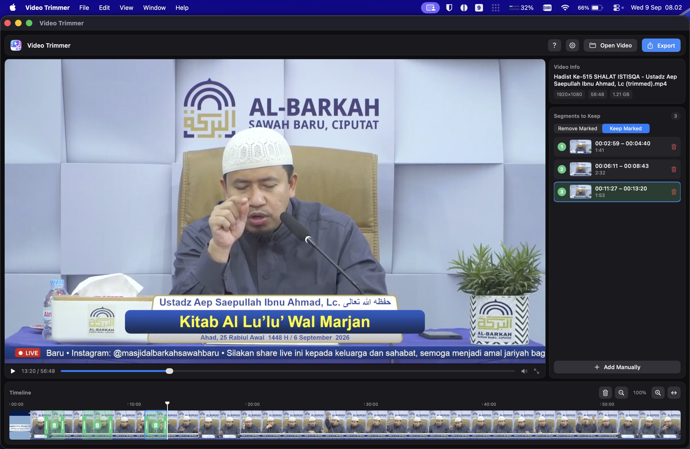

<p align="center">
  
</p>

<h1 align="center">Video Trimmer</h1>

<p align="center">
  Cut unwanted stretches out of a video — ad breaks, dead air, pauses in a recorded lecture —
  and export what's left as a single file.<br>
  Native macOS, built with SwiftUI and powered by <code>ffmpeg</code>. Apple Silicon only.
</p>

<p align="center">
  <a href="#install">
    
  </a>
  <a href="https://github.com/ahmadarif-lab/video-trimmer/releases/latest">
    
  </a>
</p>

## Install

> [!TIP]
> **Homebrew is the easiest way — one command, nothing else to set up:**
>
> ```sh
> brew install --cask ahmadarif-lab/tap/video-trimmer
> ```
>
> It adds the `ahmadarif-lab/tap` tap, installs `ffmpeg` alongside the app, and clears the
> quarantine flag, so Video Trimmer opens straight away — no Gatekeeper warning to click through.

### Updating

Video Trimmer checks for a new release when it launches and every six hours after that, and puts a
blue dot on the gear button when one is out. Open that panel and click **Install Update**: a
Homebrew install is upgraded in place, then **Relaunch to Finish** switches to the new version. A
copy installed from the DMG shows **Download Update** instead, which opens the release page.

Or from the terminal:

```sh
brew upgrade --cask video-trimmer
```

### Manual install (DMG)

Download `VideoTrimmer.dmg` from
[Releases](https://github.com/ahmadarif-lab/video-trimmer/releases/latest) and drag the app onto the
`Applications` shortcut beside it. The Homebrew install handles two more steps for you; here you do
them by hand:

1. **Clear the quarantine flag.** The app is ad-hoc signed rather than signed with a Developer ID
   and notarized, so macOS quarantines a copy downloaded through a browser, and Gatekeeper then
   refuses to open it — *"Apple could not verify Video Trimmer is free of malware"*:

   ```sh
   xattr -dr com.apple.quarantine /Applications/"Video Trimmer.app"
   ```

   Or open it once through **System Settings → Privacy & Security**, where an **Open Anyway**
   button appears after a blocked launch. Right-clicking the app and choosing **Open** no longer
   works: macOS 15 removed that bypass for apps without a Developer ID signature.

2. **Install `ffmpeg`** with `brew install ffmpeg`, or from the app's settings panel.

## Screenshots

<p align="center">
  
  
</p>

<p align="center"><em>The same three marks read both ways — red is cut out, green is what survives.</em></p>

<p align="center">
  
  
</p>
<p align="center">
  
</p>

## Features

- Drag across the filmstrip timeline to mark a stretch; drag the handles to fine-tune. Segments
  clamp against their neighbours, so they never overlap.
- Two ways to read those marks: **Remove Marked** drops them and keeps the rest, **Keep Marked**
  does the opposite and exports only what you marked. The same marks work either way — flip the
  switch to invert the result.
- **Split into separate files** turns each resulting stretch into its own video: mark three parts
  in Keep mode and you get three files, rather than one joined export.
- Timeline built from real thumbnails, with a ruler, playhead, and zoom.
- Export at the original resolution or downscale to 1080p / 720p / 480p, each showing an estimated
  output size.
- Live progress with stage, ETA, and cancel.
- Hardware encoding through VideoToolbox — typically around 7× realtime on Apple Silicon.
- Keeps itself up to date: checks for new releases, and a Homebrew install updates in place.
- Manages its own `ffmpeg` dependency: check the version, install it, or update it from the
  settings panel.
- Drop a video from Finder anywhere on the window to open it.

## Shortcuts

| Key | Action |
| --- | --- |
| `Space` | Play / pause |
| `←` / `→` | Seek 10 seconds back / forward |
| Pinch or `⌘`-scroll | Zoom the timeline |

## Requirements

- macOS 14 (Sonoma) or later, on Apple Silicon
- `ffmpeg` and `ffprobe` in `/opt/homebrew/bin` — installed for you by the cask, or
  `brew install ffmpeg`, or from the app's settings panel
- Xcode command line tools, only if you build from source

## Build and run

```sh
./build.sh
open ~/Applications/"Video Trimmer.app"
```

`build.sh` compiles the sources, assembles the `.app` bundle, and ad-hoc signs it — no Xcode project
or developer certificate involved. Pass a path to install elsewhere:

```sh
./build.sh /Applications/"Video Trimmer.app"
```

## Package a DMG

```sh
./package-dmg.sh
```

Builds a fresh copy into `dist/` and writes `dist/VideoTrimmer.dmg`, containing the app beside an
`/Applications` shortcut to drag it onto. The app inside is ad-hoc signed and not notarized, so
anyone who downloads the DMG through a browser has to clear the quarantine flag first — see
[Manual install (DMG)](#manual-install-dmg).

## Support

This app is free, and there is no donation link. If it saved you some time, please pray that Allah
grants me and my family Paradise. That is all I ask for it.

## License

MIT — see [LICENSE](LICENSE).
